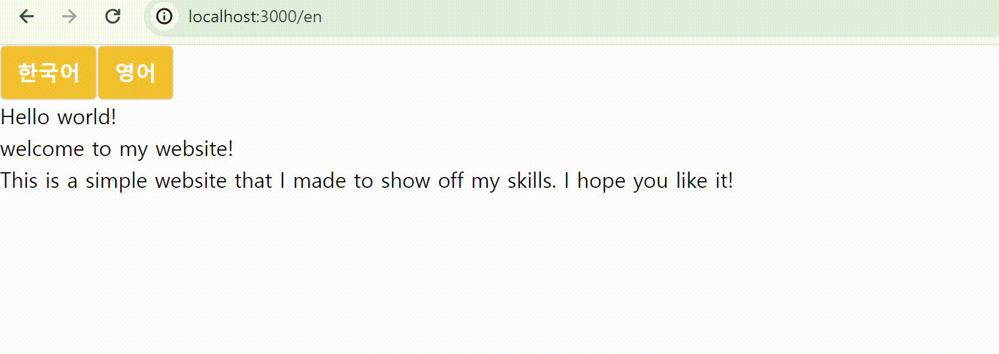
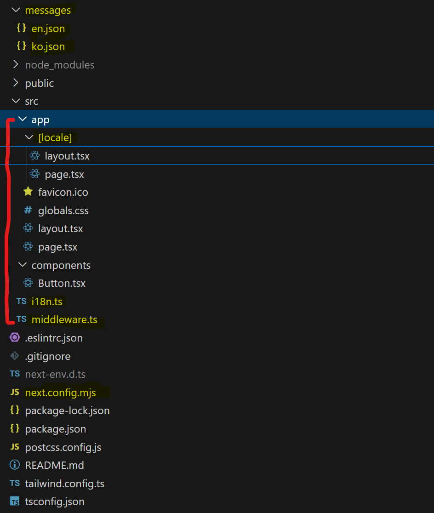
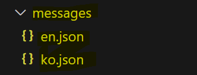
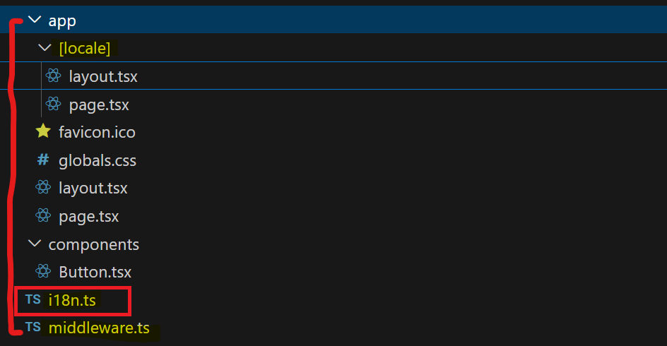
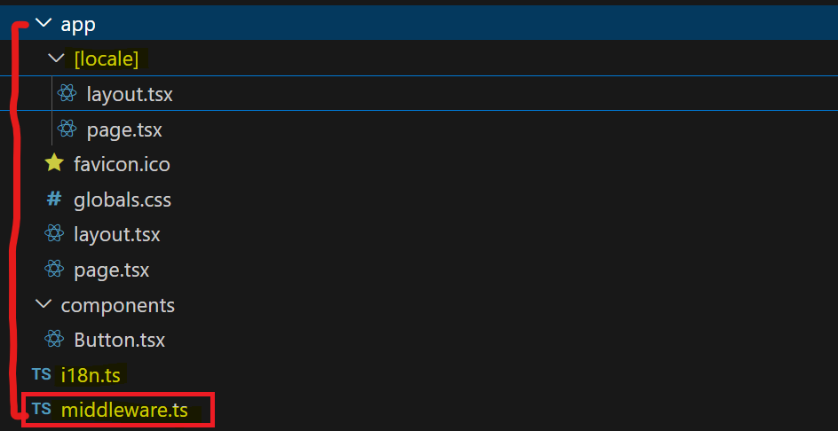

# next 다국어 지원 next-intl



[next-intl 링크](https://next-intl-docs.vercel.app/docs/getting-started)

```

npm install next-intl

다국어 지원 라이브러리 next-intl

```

<br/>
<br/>
<br/>

## 폴더구조

```
폴더구조

├── messages (1)
│   ├── en.json
│   └── ...
├── next.config.mjs (2)
└── src
    ├── i18n.ts (3)
    ├── middleware.ts (4)
    └── app
        └── [locale]
            ├── layout.tsx (5)
            └── page.tsx (6)
```

<br/>

## 현재 프로젝트 폴더구조



<br/>
<br/>
<br/>

## 1. 메세지 폴더 설정



```json
// ko.json
{
  "main": {
    "title": "헬로 월드!",
    "subTitle": "방문한것을 환영한다!"
  }
}

// en.json
{
  "main": {
    "title": "Hello world!",
    "subTitle": "welcome to my website!",
    "summary": "This is a simple website that I made to show off my skills. I hope you like it!"
  }
}

```

내용이 누락되면 어떻게되나 확인할려고 한국어 json은 summary를 넣지 않았음.
<br/>
<br/>
<br/>

## 2. next.config.js 변경

```js
// next.config.mjs
import createNextIntlPlugin from 'next-intl/plugin';

const withNextIntl = createNextIntlPlugin();

/** @type {import('next').NextConfig} */
const nextConfig = {};

export default withNextIntl(nextConfig);
```

```js
// next.config.js
const createNextIntlPlugin = require('next-intl/plugin');

const withNextIntl = createNextIntlPlugin();

/** @type {import('next').NextConfig} */
const nextConfig = {};

module.exports = withNextIntl(nextConfig);
```

프로젝트의 config 뒤에 붙은 확자 이름과 맡게 복사해서 붙혀넣어준다.

<br/>
<br/>
<br/>

## 3. i18n.ts



```ts
import { getRequestConfig } from 'next-intl/server';
import { notFound } from 'next/navigation';

// Can be imported from a shared config
const locales = ['en', 'ko'];

export default getRequestConfig(async ({ locale }) => {
  // Validate that the incoming `locale` parameter is valid
  if (!locales.includes(locale as any)) notFound();

  return {
    messages: (await import(`../messages/${locale}.json`)).default,
  };
});
```

locales배열에 포함되지 않는경우 notFound를 호출하여 404페이지를 반환함<br/>
locales에 해당되면 해당 locale 메세지를 반환함

<br/>
<br/>
<br/>

## 4. middleware.ts



```ts
import createMiddleware from 'next-intl/middleware';

export default createMiddleware({
  // 지원하는 언어
  locales: ['en', 'ko'],
  // 기본 언어
  defaultLocale: 'ko',
});

export const config = {
  // 미들웨어를 적용할 경로
  matcher: ['/', '/(ko|en)/:path*'],
};
```

<br/>
<br/>
<br/>

## 5. app/[locale]/layout.tsx

```tsx
export default function LocaleLayout({
  children,
  params: { locale },
}: {
  children: React.ReactNode;
  params: { locale: string };
}) {
  return <body lang={locale}>{children}</body>;
}
```

<br/>
<br/>
<br/>

## 6. app/[locale]/page.tsx

```tsx
import { useTranslations } from 'next-intl';

export default function Home() {
  const t = useTranslations('main'); // json key 값

  return (
    <div>
      <h1>{t('title')}</h1>
      <p>{t('subTitle')}</p>

      <p>{t('summary')}</p>
    </div>
  );
}
```
